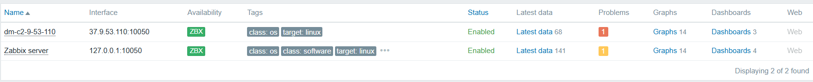

Выполнил Зинченко Андрей в рамках домашнего задания по мониторингу

# Zabbix Monitoring Infrastructure - Ansible Automation

Автоматизированное развертывание системы мониторинга Zabbix 7.0 LTS с интеграцией Telegram уведомлений через Ansible.

# Содержание
1. [Выполнение пунктов задания](#выполнение-пунктов-задания)
2. [Архитектура решения](#архитектура-решения)
3. [Структура проекта](#структура-проекта)
4. [Ручная настройка после развертывания](#ручная-настройка-после-развертывания)
5. [Верификация работы](#верификация-работы)
6. [Возможные проблемы и решения](#возможные-проблемы-и-решения)

# Выполнение пунктов задания

### 1. Автоматизированная установка Zabbix Server 7.0 LTS
**Реализация:**
- Zabbix Server 7.0 LTS с поддержкой MySQL/MariaDB
- Веб-интерфейс через nginx с оптимизированной PHP 8.1 конфигурацией
- Автоматическая настройка базы данных с импортом схемы

**Ключевые компоненты:**
```
- name: "Установка Zabbix Server, Frontend, Agent и nginx"
  apt:
    name:
      - zabbix-server-mysql
      - zabbix-frontend-php
      - zabbix-nginx-conf
      - nginx
```

### 2. Настройка Zabbix Agent на втором сервере
**Особенности реализации:**
- Автоматическая регистрация агента через HostMetadata
- Пользовательские параметры мониторинга (CPU, Memory, Disk, Network)
- Безопасная конфигурация с ограничением удаленных команд
- Production-ready логирование и error handling

**Пример пользовательских параметров:**
```
UserParameter=cpu.usage.user,cat /proc/stat | head -1 | awk '{print ($2*100)/($2+$3+$4+$5+$6+$7+$8)}'
UserParameter=memory.usage.percent,free | grep Mem | awk '{printf("%.2f", ($3/$2)*100)}'
```

### 3. Telegram Integration для уведомлений
**Особенности реализации:**
- Автоматическое создание Telegram скрипта через j2 template
- Retry логика с 3 попытками отправки
- Markdown форматирование сообщений с эмодзи
- Персонализированные уведомления с фамилией пользователя

**Пример уведомления:**
```
🚨 *Zabbix Alert от { Имя из vault zabbix_server }*

*Тема:* PROBLEM: High CPU usage on dm-c2-9-53-110

*Сообщение:*
CPU utilization: 95%

*Время:* 2025-06-06 10:30:15
*Сервер:* dm-c2-9-53-61
```

# Архитектура решения

## Компоненты системы
- **Zabbix Server (37.9.53.61):** nginx + PHP 8.1-FPM + MariaDB + Zabbix 7.0
- **Zabbix Agent (37.9.53.110):** Zabbix Agent 7.0 с custom параметрами
- **Telegram Bot:** Интеграция через API для уведомлений

## Технологический стек
- **OS:** Ubuntu 24.04 LTS
- **Database:** MariaDB 10.6
- **Web Server:** nginx с optimized конфигурацией
- **PHP:** 8.1-FPM с Zabbix-специфичными настройками
- **Automation:** Ansible с зашифрованными переменными (vault)

# Структура проекта

```
.
├── ansible.cfg                   # Конфигурация Ansible
├── host_vars                     # Переменные хостов
│   ├── zabbix_agent
│   │   └── vault.yaml            # Зашифрованные данные агента
│   └── zabbix_server
│       └── vault.yml             # Зашифрованные данные сервера
├── inventory
│   └── inventory.yml             # Инвентарь серверов
├── playbook.yml                  # Основной playbook
└── roles
    ├── zabbix_agent              # Роль для Zabbix Agent
    │   ├── handlers
    │   │   └── main.yml          # Handlers для перезапуска сервисов
    │   ├── tasks
    │   │   └── main.yml          # Задачи установки и настройки агента
    │   ├── templates
    │   │   ├── zabbix_agentd.conf.j2            # Конфигурация агента
    │   │   └── zabbix_agentd.userparams.conf.j2 # Пользовательские параметры
    │   └── vars
    │       └── main.yml          # Переменные роли агента
    └── zabbix_server             # Роль для Zabbix Server
        ├── handlers
        │   └── main.yml          # Handlers для перезапуска сервисов
        ├── tasks
        │   └── main.yml          # Задачи установки полного стека
        ├── templates
        │   ├── nginx_zabbix.conf.j2    # nginx конфигурация
        │   ├── telegram.sh.j2          # Telegram скрипт
        │   ├── zabbix_php.ini.j2       # PHP настройки для Zabbix
        │   └── zabbix_server.conf.j2   # Конфигурация Zabbix Server
        └── vars
            └── main.yml          # Переменные роли сервера
```

# Ручная настройка после развертывания

⚠️ **ВАЖНО!** После успешного выполнения Ansible требуется ручная настройка в веб-интерфейсе:

## 1. Настройка пользователя Admin для Telegram
```
Users → Users → Admin → Media
```
**Настройки:**
- **Type:** Telegram
- **Send to:** { id бота }
- **When active:** 1-7,00:00-24:00
- **Use if severity:** Отметить все уровни


## 2. Создание Autoregistration Action
```
Alerts → Actions → Autoregistration actions → Create action
```
**Настройки:**
- **Name:** Linux Servers Auto Registration
- **Conditions:** Host metadata contains "Linux Server"
- **Operations:** 
  - Add to host groups: Linux servers
  - Link to templates: Linux by Zabbix agent


## 3. Добавление Template к автоматически появившемуся агенту
```
Data collection → Hosts → dm-c2-9-53-110 → Templates
```
**Добавить:** `Linux by Zabbix agent`



## 4. Создание триггеров для мониторинга
```
Data collection → Hosts → dm-c2-9-53-110 → Triggers → Create trigger
```
**Пример триггера High CPU:**
- **Name:** High CPU usage on {HOST.NAME}
- **Severity:** Warning
- **Expression:** `last(/dm-c2-9-53-110/system.cpu.util[,user])>80`

## 5. Настройка Action для Telegram уведомлений
```
Alerts → Media types → Telegram → Update
```
**Настройки:**
- **Status:** Enableed


## 6. Настройка Action для Telegram уведомлений
```
Alerts → Actions → Trigger actions → Create action
```
**Настройки:**
- **Name:** Telegram CPU Alerts
- **Operations:** Send message to Admin via Telegram

# Запуск развертывания

Через GitHub → Actions

# Верификация работы

### 1. Проверка статуса сервисов
```
# На Zabbix Server
systemctl status zabbix-server nginx php8.1-fpm mariadb

# На Zabbix Agent  
systemctl status zabbix-agent
```

### 2. Проверка веб-интерфейса
- **URL:** http://37.9.53.61
- **Логин:** Admin
- **Пароль:** zabbix

### 3. Проверка мониторинга
```
# Генерация нагрузки для тестирования
stress --cpu 4 --timeout 60
```

**Ожидаемый результат:**
- ✅ Все сервисы в статусе active (running)
- ✅ Веб-интерфейс доступен
- ✅ Agent статус Available в интерфейсе
- ✅ Telegram уведомления приходят с фамилией "Боб"

# Возможные проблемы и решения

## Проблема: Agent статус Unknown
**Причина:** Не добавлен template или хост не найден

**Решение:**
1. Добавить template `Linux by Zabbix agent` к хосту
2. Проверить autoregistration action
3. Убедиться что hostname совпадает

## Проблема: Telegram уведомления не приходят
**Причина:** Не настроен Media для пользователя Admin

**Решение:**
1. Добавить Telegram media пользователю Admin
2. Создать Action для trigger уведомлений
3. Проверить токен бота и chat_id

# Мониторинг Production Environment

### Критические метрики
- **CPU utilization > 80%** - Warning
- **Memory usage > 85%** - Average  
- **Disk space  5** - High

### Telegram уведомления
Reports → Action log


Все критические события автоматически отправляются в Telegram с:
- 🚨 Персонализированными сообщениями от "{ Имя из vault zabbix_server }"
- ⏰ Временными метками
- 🖥️ Информацией о сервере
- 📊 Детальными метриками

